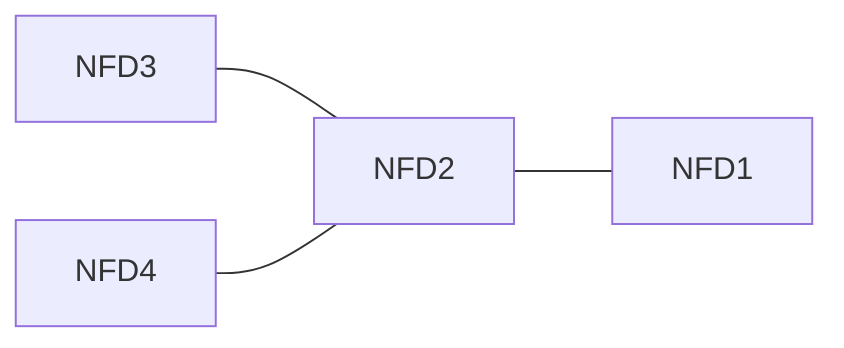
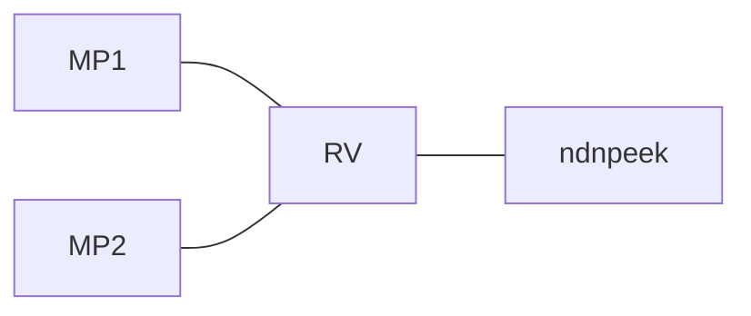

# KiteStrategy tests

These are tests for KiteStrategy which is built into NFD for supporting forwarding hint based KITE.

## Requirements

```bash
vagrant>=2.2.19
virtualbox>=6.1.34
```

4 virtual machines will  be strated to run tests in total. The minimum requirements of tests are: 4 cpus, 2GB memory.

## Envrionment

Overall envrionment is as following:

`KiteStrategy` is enabled on each started NFDs under namespace `/kite-test`. MP's prefix is `/kite-test/alice`, RV's prefix is `/kite-test/rv`. Keys and certs are loaded into NFDs automatically.

In each test, every NFD except where RV connected will be added a `/kite-test/rv` route pointing out where `RV` located.

## How to run tests
### package base box
Use following commands to package base box:
```shell
vagrant box add hashicorp/bionic64
vagrant up
vagrant ssh <<ENDSCRIPT
cd /home/compile
./install.sh
ENDSCRIPT
vagrant package
vagrant box add package.box --name glassyyang/kite-test-env
```

### Run tests
Go into `tests` folder and run `test.sh` to run all tests. Also can run `test_*.sh` except `test_common.dh` manually to
run single test.
## Test cases
Following are test cases these tests covered.
### `test_normal.sh`

`ndnpoke` runs on NFD3 and `ndnpeek` runs on NFD1. this scence test whether `KiteStrategy` runs well on common scenes.

### `test_kite_base.sh`


`RV` runs on NFD2, `MP` runs on NFD1. This test use `ndnpeek` obtaining data provided by `MP`.

### `test_kite_multi.sh`



`RV` runs on NFD2, `MP` runs on NFD3 and NFD4, `ndnpeek` runs on NFD1. this test ensure that every `MP` will receive `interest` sent by single consumer.

### `test_kite_nack.sh`


`MP1` runs on NFD3, `MP2` run on NFD4, `RV` runs on NFD2, `ndnpeek` runs on NFD1. When `MP1` receive `interests`, it will send a `NACK`. before `ndnpeek` send interest, there are two `/kite-test/alice` routes on `RV`, one is created by `MP1`, the other is created by `MP2`. Acter `ndnpeek` sends an `interest`, `NACK` will be sent to `RV` by `MP1` and will cause `RV`'s NFD delete one route.

### `test_kite_retransmission.sh`


In this test, `MP2` is disabled at the beginning. When `MP2` receive `interests`, it do nothing. after `ndnpeek` send an `interest`, `MP2` begins to register a new route. after `MP2` succeed, it will receive an `interest` sent by `ndnpeek` previously.

### `test_search_route.sh`


In this test, `MP` will send a `NACK` when it receives an `interest`.  when `ndnpeek` send an `interest`, it will be sent to `MP` firstly. at the view of NFD which `RV` runs, it will receive a `NACK`. `KiteStrategy` in this NFD will try to find a feasible route forwarding `interest`, where `RV` located will be considered to be the next trying.